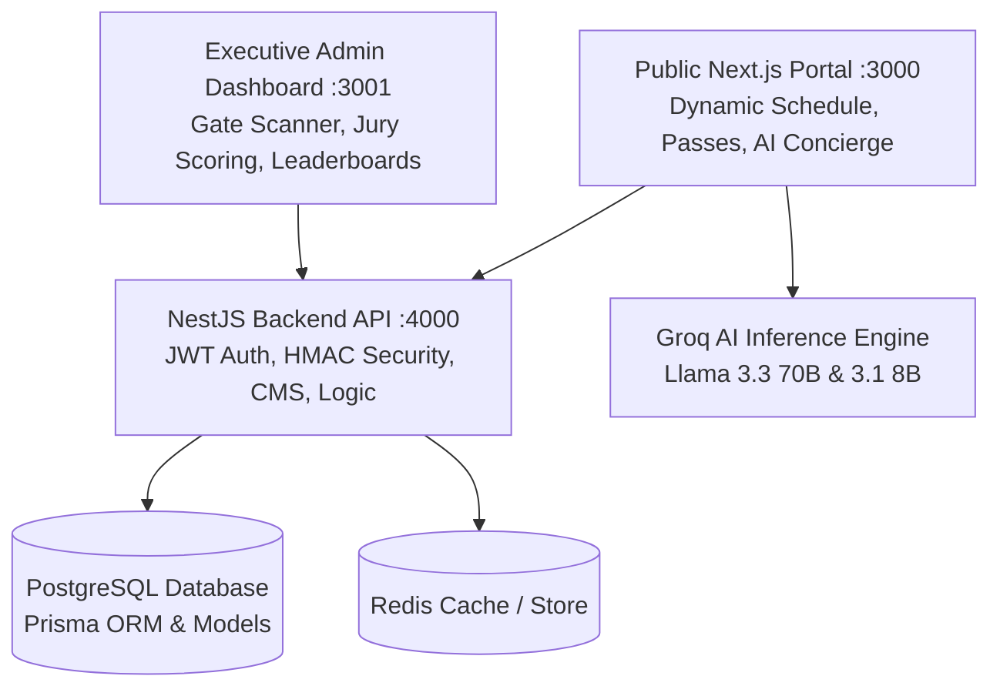

# PEC E-Summit 2026

[](https://nextjs.org/)
[](https://reactjs.org/)
[](https://www.typescriptlang.org/)
[](https://tailwindcss.com/)
[](https://nestjs.com/)
[](https://www.prisma.io/)

> Official digital platform for PEC E-Summit 2026.
> Built and maintained by E-Cell, Punjab Engineering College (PEC), Chandigarh.

---

## Ecosystem Architecture

The platform is structured into three integrated service tiers:



| Service | Port | Directory | Tech Stack | Role |
| :--- | :---: | :--- | :--- | :--- |
| **Public Experience Portal** | `3000` | `ESUMMIT/` | Next.js 14, React 18, Tailwind, Framer Motion, Lenis | Public landing page, tracks, 3D speaker roster, dynamic pass checkout, AI Concierge |
| **Operations & Command Center** | `3001` | `admin_dashboard/` | Next.js 16, Turbopack, Tailwind, Lucide, WebRTC | Volunteer Gate Scanner, Jury Pitch Rubrics, CMS Manager, CA Leaderboard |
| **Production API & Engine** | `4000` | `E_Summit_Backend/` | NestJS 10, Prisma 6, PostgreSQL, Argon2id, JWT | RESTful API, HMAC QR tickets, Razorpay webhooks, RBAC authorization |

---

## Key Platform Features

### 1. AI Concierge
- Built with Groq (Llama 3.3 70B) for natural language queries regarding the schedule, speakers, and venues.
- Includes function calling for itinerary generation and smooth scrolling navigation.
- Includes a fallback to static local data if API rate limits are reached.

### 2. QR Gate Check-In & Badging
- Digital passes are generated with unique IDs and HMAC-SHA256 signatures to prevent tampering.
- The admin dashboard features a WebRTC-based scanner for physical check-ins.
- Includes server-side duplicate protection to prevent replay attacks at the gate.

### 3. Startup Expo & Jury Scoring
- Team hub allowing attendees to create teams using invite codes and link their GitHub repositories.
- Includes a rubric-based scoring interface for jury members (Innovation, Execution, Market Size, Pitch Quality).
- Automatically updates a weighted leaderboard based on the jury's evaluations.

### 4. Design System
- **Theme Palette**: Obsidian Void (`#060B08`), Radiant Volt Green (`#7ED321`), Crimson Flame (`#FF4D3D`), and Cyan Spark (`#3DD9FF`).
- **Animations**: Uses GSAP ScrollTrigger timelines and Lenis for inertial smooth scrolling.
- **Typography**: Kanit for headings, Inter for body text, and JetBrains Mono for data displays.

---

## Technology Stack

```text
Frontend (Public & Admin):
├── Framework: Next.js 14 / Next.js 16 (App Router)
├── Styling: Tailwind CSS 3.4 & Vanilla CSS Variables
├── Animations: Framer Motion 11, GSAP 3.15, Lenis Scroll, Anime.js
├── 3D Canvas: Three.js, React Three Fiber, Drei
└── AI Engine: Groq Cloud SDK (Llama 3.3 70B, Llama 3.1 8B)

Backend API & Security:
├── Framework: NestJS 10 (Node.js LTS)
├── ORM & Database: Prisma ORM 6 & PostgreSQL 16
├── Authentication: Passport JWT, Refresh Token Family Rotation, Argon2id
├── Cryptography: Node.js Crypto HMAC-SHA256 Verification
└── Testing: Jest 29, @nestjs/testing, Supertest
```

---

## Project Structure

```text
PEC-SUMMIT/
├── app/                        # Next.js 14 App Router routes & layouts
│   ├── faq/                    # FAQ page route
│   ├── passes/                 # Pass tiers & pricing page route
│   ├── register/               # Registration & entry forms route
│   ├── schedule/               # Full event timeline & schedule route
│   ├── speakers/               # Speaker line-up page route
│   ├── sponsors/               # Sponsor ecosystem page route
│   ├── tracks/                 # Event tracks detail page route
│   ├── globals.css             # Global Tailwind directives, fonts, noise overlay
│   ├── layout.tsx              # Root layout with SmoothScroll & Session Providers
│   └── page.tsx                # Main landing page composition
├── components/                 # Component Library
│   ├── Concierge/              # Floating AI Assistant Component
│   ├── EsummitAbout/           # About section
│   ├── EsummitHero/            # Hero section with live ticker
│   ├── EsummitMarquee/         # Horizontal text and visual showcase
│   ├── EsummitSpeakers/        # Highlighted speaker cards
│   ├── EsummitTracks/          # Event tracks list & details
│   ├── FAQ/                    # Expandable FAQ accordion
│   ├── Footer/                 # Footer navigation links
│   ├── Nav/                    # Header navigation & mobile drawer
│   ├── Providers/              # Context providers
│   ├── Speakers/               # 3D interactive speaker cards grid
│   ├── Sponsors/               # Partner & sponsor logo marquee
│   ├── StatBurst/              # Animated stats counter
│   ├── Timeline/               # Interactive day schedule timeline
│   └── ui/                     # Reusable atomic UI components
├── hooks/                      # Custom React Hooks
├── lib/                        # Data stores, metadata & API integrations
│   ├── api.ts                  # Backend API fetching utilities
│   └── data.ts                 # Festival metadata, tracks, speakers, FAQ data
└── public/                     # Static assets, logos, icons, PWA manifest
```

---

## Event Tracks & Highlights

| Track | Category | Description |
| :--- | :--- | :--- |
| **Pitch Competition** | Founders Stage | Present startup decks to VCs and angel investors for funding and mentorship. |
| **Panel Discussions** | Thought Leadership | Panels with founders, CXOs, and tech policy makers. |
| **Startup Expo** | Show + Tell | Student & early-stage startups showcasing live products to attendees. |
| **24-Hour Hackathon** | 24-Hr Build | Intensive 24-hour sprint in AI, Web3, Deep-Tech, and Climate Tech. |
| **Networking Mixer** | Connect | Speed networking, 1-on-1 Investor Open Hours, and social evening. |

---

## Getting Started Locally

### 1. Prerequisites
- **Node.js**: `v18.17+` or `v20.x`
- **PostgreSQL**: `v15+` (local or via Docker)
- **Package Manager**: `npm` (recommended)

---

### 2. Backend Setup & Database Seeding

```bash
# Navigate to backend directory
cd E_Summit_Backend

# Install dependencies
npm install

# Configure environment
cp .env.example .env

# Apply database migrations & seed initial schedule/users
npx prisma migrate dev
npm run db:seed

# Start backend server (Port 4000)
npm run start:dev
```

---

### 3. Public Frontend Portal Setup

```bash
# Navigate to public frontend directory
cd ../ESUMMIT

# Install dependencies
npm install --legacy-peer-deps

# Configure environment
cp .env.example .env.local

# Run production build or dev server (Port 3000)
npm run build
npm run start

# OR for hot-reload dev:
npm run dev
```

---

### 4. Admin Operations Dashboard Setup

```bash
# Navigate to admin dashboard directory
cd ../E_Summit_Backend/admin_dashboard

# Install dependencies
npm install

# Configure environment
cp .env.local.example .env.local

# Start admin dashboard (Port 3001)
npm run dev
```

---

## Default Seeded Accounts

All pre-seeded demo accounts share the password **`PecSummit@2026`**:

| Role | Email | Permissions / Features |
| :--- | :--- | :--- |
| **Super Admin** | `admin@pecsummit.com` | Full command telemetry, user overrides, CMS control |
| **Organizer** | `organizer@pecsummit.com` | Schedule management, speaker updates, delegate exports |
| **Gate Volunteer** | `volunteer@pecsummit.com` | Live WebRTC QR scanner & attendee manual lookup |
| **Investor / Jury** | `investor@pecsummit.com` | Pitch evaluation, startup scoring rubrics |
| **Campus Ambassador**| `ca@pecsummit.com` | Referral link tracking, leaderboard rank |
| **Delegate** | `delegate@pecsummit.com` | Digital pass, workshop access |

---

## Running Automated Tests

```bash
# Run all backend unit & integration test suites
cd E_Summit_Backend
npm test

# Run tests in watch mode
npm run test:watch

# Generate code coverage report
npm run test:cov
```

**Test Coverage Summary**:
- `src/auth/auth.service.spec.ts` (Authentication, hashing, JWT token rotation)
- `src/checkin/checkin.service.spec.ts` (HMAC QR ticket checks & anti-replay)
- `src/common/utils/qr.util.spec.ts` (Cryptographic signing & tampering detection)
- `src/admin/admin.service.spec.ts` (Analytics aggregation & CA calculations)
- `src/teams/teams.service.spec.ts` (Jury scoring & leaderboard algorithms)
- `src/cms/cms.service.spec.ts` (Festival events, speakers, and sponsors CMS)
- `src/health/health.controller.spec.ts` (Database & service health ping)

---

## Organization & Contacts

**E-Cell PEC (Entrepreneurship Cell)**  
*Punjab Engineering College (Deemed to be University), Sector 12, Chandigarh - 160012*

- **Website**: [ecellpec.in](https://ecellpec.in)
- **Email**: support@pec-esummit.org

<div align="center">
  <sub>Maintained by the E-Cell PEC Dev Team.</sub>
</div>